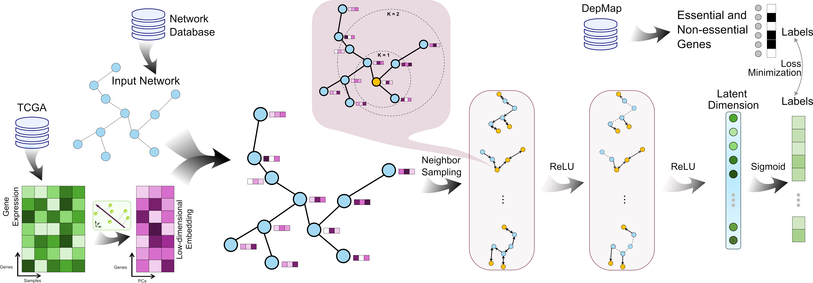

# EssSubgraph: An inductive representation learning method that integrates graph-structured network data with omics features

[](https://www.gnu.org/licenses/gpl-3.0)

EssSubgraph is a predictive framework designed to identify essential genes in mammals by integrating gene expression data with large-scale biological networks. The core idea is to extract subgraphs related to gene essentiality from multi-layer interaction networks and apply graph neural networks to learn informative representations for prediction.

The following depicts a broad overview over the EssSubgraph method.



## Installation & Dependencies
The code is written in Python 3 and was mainly tested on Python 3.8 and a Linux OS but should run on any OS that supports python and pip. Training is faster on a GPU.

EssSubgraph has the following dependencies:
* Numpy
* Pandas
* torch
* Networkx
* scipy
* seaborn
* scikit-learn
* torch-geometric

Build conda environment
```
conda create --name py38 -c conda-forge  python=3.8
conda activate py38
```

Dependencies can be installed using the following command:
```
pip install -r requirements.txt
```

## Reproducibility
### Network Preprocessing
EssSubgraph was tested with 7 different protein-protein interaction (PPI )networks, namely:
* [BioGRID](https://downloads.thebiogrid.org/File/BioGRID/Release-Archive/BIOGRID-4.4.247/BIOGRID-ALL-4.4.247.tab2.zip)
* [ConsensusPathDB](http://cpdb.molgen.mpg.de/download/ConsensusPathDB_human_PPI.gz)
* [HumanNet](https://www.inetbio.org/humannet/networks/HS-PI.symbol.tsv.gz)
* [iRefIndex](http://irefindex.org/download/irefindex/data/archive/release_14.0/psi_mitab/MITAB2.6/9606.mitab.07042015.txt.zip)
* [Pathway Commons](https://download.baderlab.org/PathwayCommons/PC2/v12/PathwayCommons12.All.hgnc.txt.gz)
* [PCNet](https://www.ndexbio.org/index.html#/networkset/e8ebbdde-86dc-11e7-a10d-0ac135e8bacf?accesskey=7fbd23635b798321954e66c63526c46397a3f45b40298cf43f22d07d4feed0fa)
* [STRING](https://stringdb-downloads.org/download/protein.links.detailed.v12.0.txt.gz)

The network was constructed using the tutorial from [Network Evaluation Tools](https://github.com/idekerlab/Network_Evaluation_Tools/tree/master).

### Node feature Preprocessing
The gene expression data (TCGA RNA-Seq normalized RSEM data) was obtained from [Albino Bacolla](https://zenodo.org/records/7885656).
```
python generate_pca.py
```

### Dataset build
```
python build_dataset_container.py \
    --network ./data/string_net.txt \
    --essential ./data/Essential_genes \
    --nonessential ./data/Non_essential_genes \
    --features ./data/cancer_full_expression_pc50.csv \
    --output esssubgraph_human_pc50_string.pkl
```
The detailed descriptions about the arguments are as following:
| Parameter name         | Description                                                                 |
|-------------------------------|-------------------------------------------------------------------------|
| `--network`       | Path to the network file (e.g., `/path/to/string_net.txt`). Specifies the gene interaction network to process. |
| `--essential`     | Path to the essential genes file (e.g., `../data/Essential_genes`). Lists genes critical for cell survival. |
| `--nonessential`  | Path to the non-essential genes file (e.g., `../data/Non_essential_genes`). Lists non-critical genes. |
| `--features`      | Path to the gene feature CSV file. Contains node feature data (e.g., gene expression PC50 features). |
| `--output`        | Output pickle file name for the PyTorch Geometric dataset. The network name is appended (e.g., `esssubgraph_human_pc50_string.pkl`). |


### Usage
```
python EssSubgraph.py --epochs 200 --device 0 --dataset ./data/esssubgraph_human_pc50_string.pkl
```
The detailed descriptions about the arguments are as following:
| Parameter name | Description of parameter |
| --- | --- |
| --dataset         | The path of the input pkl file             |
| --epochs    | Number of epochs to train the model (defaults to 200) |
| device | Device id of gpus (defaults to 0)|

### Docker Setup
To ensure reproducibility, build and run the project with Docker:
```
#Build Docker Image
docker build -t esssubgraph .

#Run Docker Container
docker run -it -v $(pwd):/app esssubgraph
```

### Benchmark Models
To reproduce performance comparisons with other models, scripts under `\baseline` can be used.

## License
GNU General Public License v3.0 (see `LICENSE`).

## Contact
If you have any questions, feel free to contact me through Email (dal462929@utdallas.edu) or Github issues. Pull requests are highly welcome!


